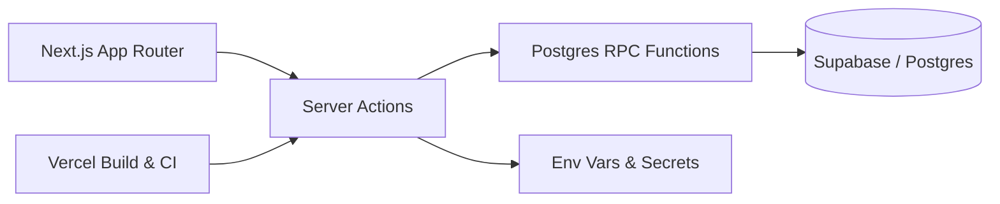

## Context

**Project:** TimeBookt  
**Milestone:** TBKT-0 — Foundations live in production  
**Stack:** Next.js, Supabase, Vercel, TypeScript

This Lab Note documents a milestone I don’t want to forget — not because it was elegant, but because it was *real*.

TimeBookt’s foundation is now live in production. Getting there surfaced multiple failure modes that don’t show up in tutorials, happy-path examples, or local development.

This note exists to document what actually broke, why it broke, and what ultimately worked.

---

## What I Thought I Was Doing

At a high level, TBKT-0 felt straightforward:

- Stand up a Next.js app
- Use Supabase for auth and persistence
- Implement server actions for writes
- Push to Vercel
- Move on to product features

Locally, everything worked:
- Inserts worked
- UI worked
- Data flowed

Then I ran a production build.

---

## What Actually Broke

TypeScript inference collapsed in production builds — specifically around Supabase **writes**.

Symptoms included:
- Valid `.insert(payload)` calls failing with `never`
- RPC calls rejecting argument objects as `undefined`
- Code working locally but failing during Vercel’s type check phase

None of the failures were caused by incorrect business logic.

They were caused by abstraction boundaries leaking under strict builds.

<Callout type="warning" icon="⚠️">
Supabase JS typings can irreversibly collapse to <code>never</code> in strict Next.js + Vercel builds.
Once that happens, you stop debugging and route around it.
</Callout>

---

## The Real Problem (Not the Symptoms)

The core issue was not optional fields, payload shape, or schema mismatch.

It was this:

> **Supabase’s JavaScript typings are brittle for mutations in strict server environments.**

Once TypeScript loses the generic chain for a Supabase write, it cannot be recovered inside the type system.

No amount of casting, generics, or overload tricks fixes it.

<Callout type="insight" icon="💡">
When a library’s types lie, your job is not to convince them — it’s to isolate them.
</Callout>

---

## Decisions That Unblocked Everything

Once I stopped fighting TypeScript and started treating infrastructure as an untrusted boundary, progress resumed.

Key decisions:

### 1. Move All Writes to Postgres RPC

- Centralized persistence logic
- Cleaner transactional boundaries
- Eliminated `.insert()` / `.update()` from application code

### 2. Introduce a Thin RPC Shim

A single `rpcCall()` helper:
- Uses `unknown`, not `any`
- Bypasses broken overload resolution
- Keeps the hack isolated to one file

### 3. Keep Strong Typing at the Domain Boundary

- Domain logic remains strictly typed
- Infrastructure responses are validated or mapped explicitly

### 4. Choose Platform Stability Over Novelty

- Downgraded to **Next.js 14.x**
- Removed Turbopack from production builds
- Avoided a Next.js 15 CVE block by choosing a known-stable line

<Callout type="experiment" icon="🧪">
Early SaaS foundations benefit more from boring stability than from the newest platform features.
</Callout>

---

## Final Architecture (TBKT-0)

This architecture draws a hard line between:

* **Domain logic** (typed, trusted)
* **Infrastructure boundaries** (explicit, defensive)

---

## What I’d Do Differently Next Time

Lessons learned the hard way:

* If Supabase writes return `never`, stop immediately
* Don’t fight the compiler when the library is wrong
* Use RPC earlier than you think
* Treat CI builds as the source of truth
* Prefer boring platforms during foundation phases

---

## Why This Matters

This milestone wasn’t about fixing a bug.

It was about learning:

* where abstractions break
* where trust belongs
* how to design systems that survive real production constraints

TimeBookt is moving forward now — not because everything is perfect, but because the foundation is **honest**.

That’s a foundation worth building on.
